# Scalable Withdrawal System: Architecture Summary

This document summarizes how to evolve a withdrawal platform from early-stage simplicity to large-scale reliability.

## Architecture Roadmap

1. Monolith to Microservices
2. Layered Architecture
3. Hexagonal (Ports and Adapters)
4. Event-Driven Design
5. Saga Pattern
6. Outbox Pattern
7. CQRS
8. Cell-Based Architecture
9. Active-Active vs Active-Passive
10. Observability-Driven Architecture

## 1. Monolith to Microservices

### Why start with a monolith

- Fastest path to production
- Simpler deployments and debugging
- Strong local transactions


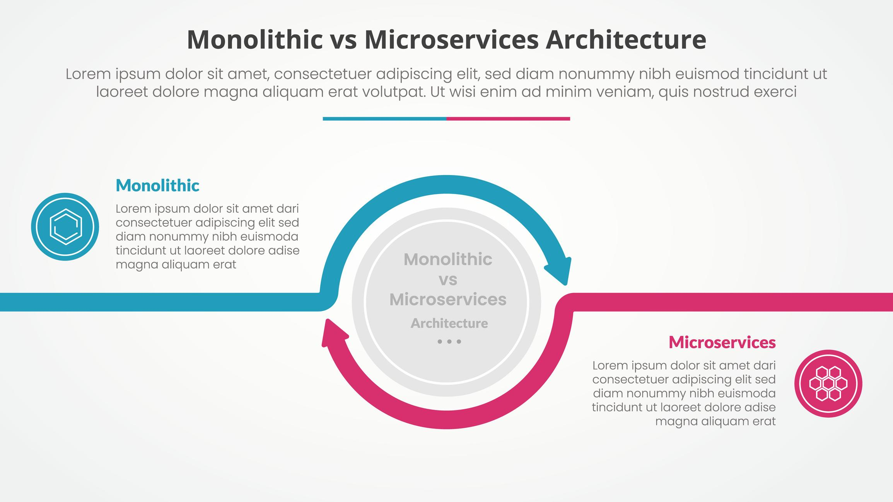


### Why evolve to microservices

- Independent scaling by domain
- Independent deployments
- Better team ownership boundaries

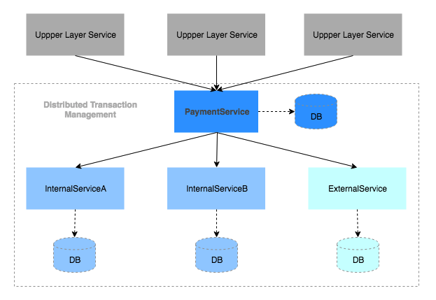
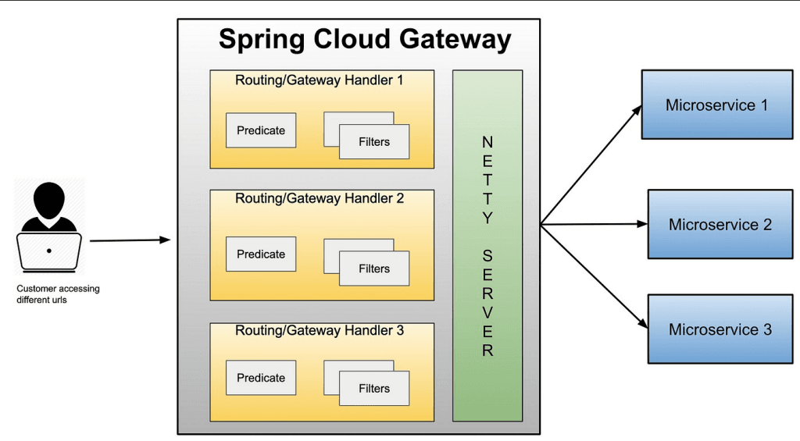

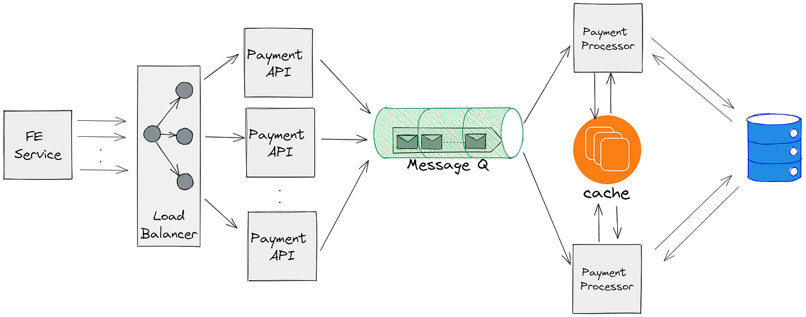

Typical service split for withdrawals:

- Withdrawal Service
- Ledger Service
- Fraud Service
- Gateway Adapter Service
- Reconciliation Service

## 2. Layered Architecture (Inside Each Service)

Use clear separation inside each service:

- Controller: request/response handling
- Service: business rules
- Repository: data access

```java
@RestController
class WithdrawalController {
  @PostMapping("/withdraw")
  public Response withdraw(@RequestBody Req req) {
    return withdrawalService.process(req);
  }
}
```

Benefits:

- Better testability
- Lower accidental coupling
- Easier maintenance

## 3. Hexagonal Architecture (Ports and Adapters)

Goal: isolate domain logic from infrastructure details.

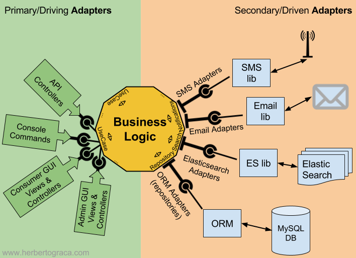


Suggested structure:

- Domain core: `WithdrawalProcessor`, `FraudPolicy`
- Ports: `PaymentGatewayPort`, `EventPublisherPort`
- Adapters: `KafkaAdapter`, `PostgresAdapter`, `GatewayAdapter`

## 4. Event-Driven Architecture

Use asynchronous messaging to reduce tight runtime coupling.

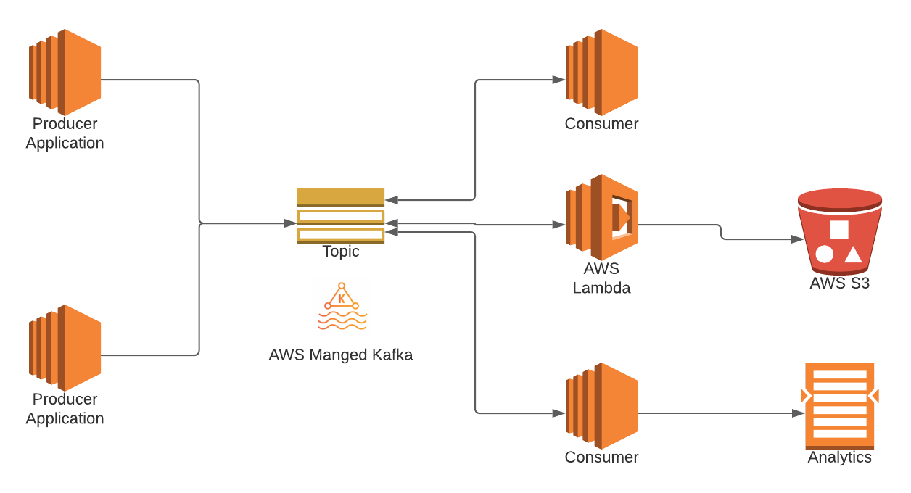
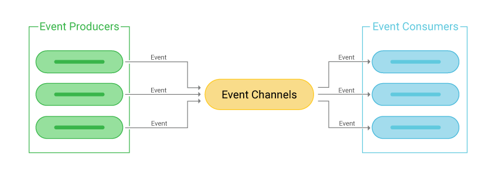
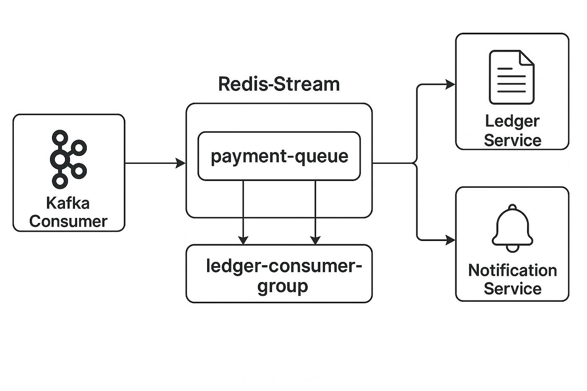


When this helps most:

- Burst traffic and variable downstream latency
- Long-running fraud or reconciliation workflows
- Replay and recovery requirements

```java
kafkaTemplate.send("withdrawal-topic", event);

@KafkaListener(topics = "withdrawal-topic")
public void consume(Event e) {
  process(e);
}
```

## 5. Saga Pattern (Distributed Consistency)

Use sagas when one business action spans multiple services.


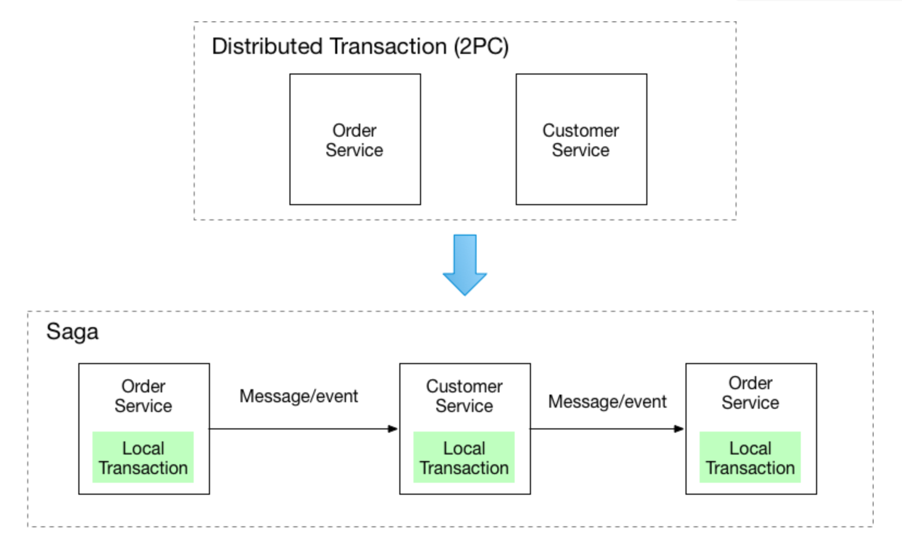

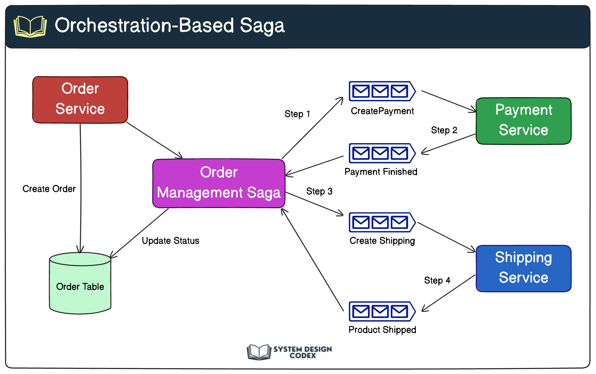

Canonical flow:

1. Reserve/debit ledger
2. Execute gateway transfer
3. On failure, run compensation (credit back)

```java
if (paymentFailed) {
  ledger.credit(userId, amount);
}
```

## 6. Outbox Pattern (Reliable Publish)

Problem: DB commit and event publish are separate systems.

Solution:

- Write business state + outbox record in one DB transaction
- Relay process publishes outbox to Kafka
- Relay marks outbox record as sent

Why it matters:

- No lost events after successful DB commits
- Predictable retry behavior

## 7. CQRS (Command Query Separation)

Separate write and read models when both have very different needs.

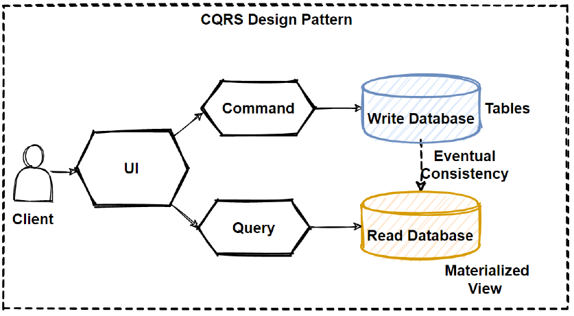


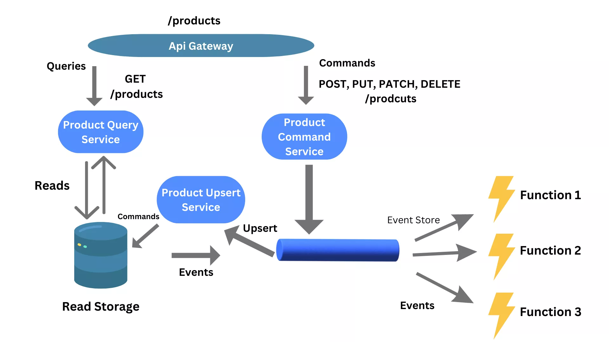

Pattern:

- Write side: ACID ledger updates
- Read side: materialized views for fast balance/history queries

## 8. Cell-Based Architecture

Partition users/tenants into isolated cells to reduce blast radius.

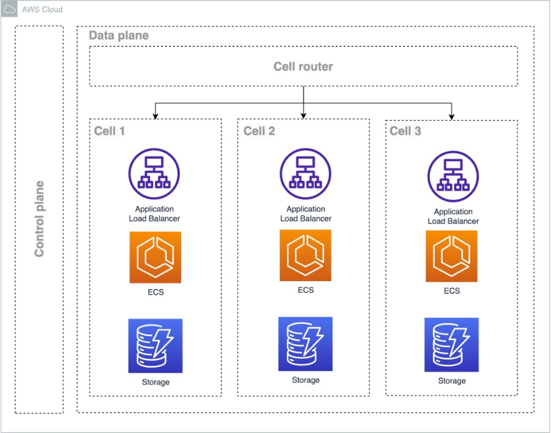
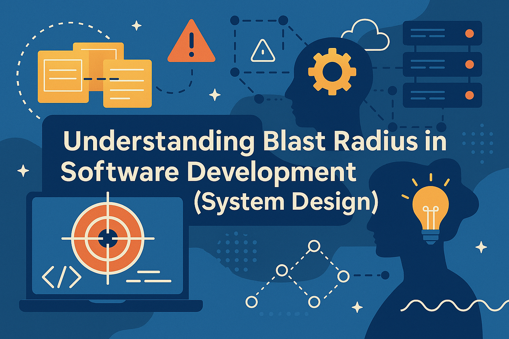
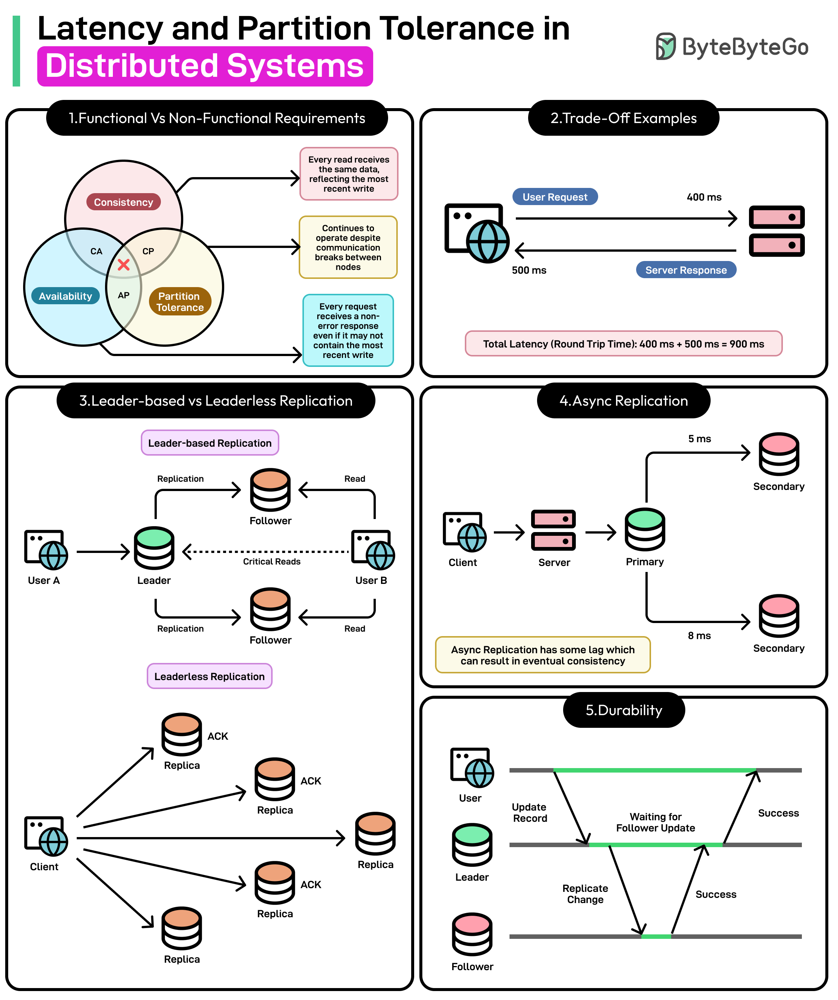


Example routing:

```text
cell = hash(userId) % N
```

Each cell can own:

- Service stack
- Data stores
- Event infrastructure

## 9. Active-Active vs Active-Passive

### Active-passive

- Simpler operations
- Slower failover

### Active-active

- Better availability
- Conflict complexity if same entity is writable in multiple regions

For financial systems, prefer clear ownership boundaries per user/account/ledger shard.

## 10. Observability-Driven Architecture

Design for diagnosis from day one.

Mandatory telemetry:

- Distributed tracing
- Structured logs with correlation IDs
- Service and infra metrics
- SLO-based alerting

Key metrics:

- `p99` end-to-end latency
- Error rate and error budget burn
- Kafka consumer lag
- DB lock wait time

## Consolidated Reference Diagrams


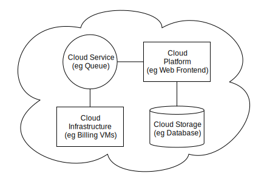

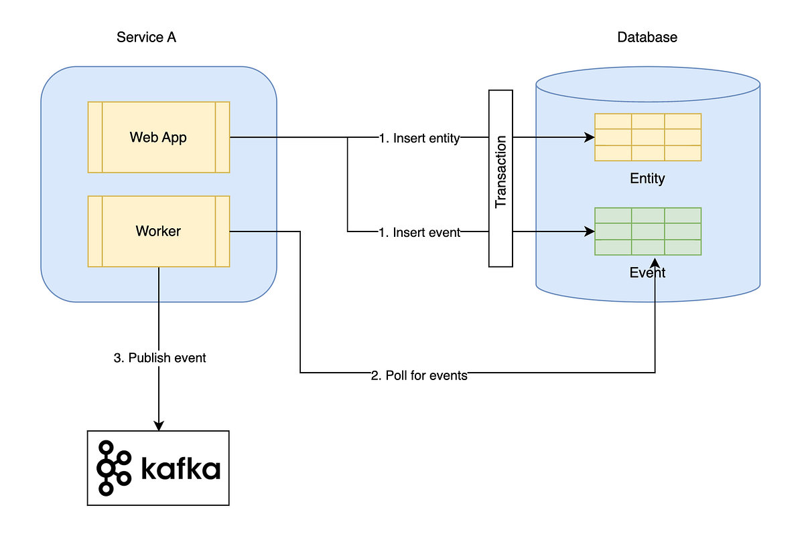

## Interview-Ready Conclusion

A strong design narrative is:

- Start simple with monolith + clean layers.
- Extract bounded-domain microservices as scale and teams grow.
- Keep domain logic isolated with hexagonal boundaries.
- Use event-driven flows for decoupling and elasticity.
- Ensure consistency with saga + outbox + idempotency.
- Scale reads independently with CQRS.
- Limit failures with cell-based partitioning.
- Improve resilience and operations with observability-first engineering.

## Notes

- All external image links from the previous version were localized to `architects/images`.
