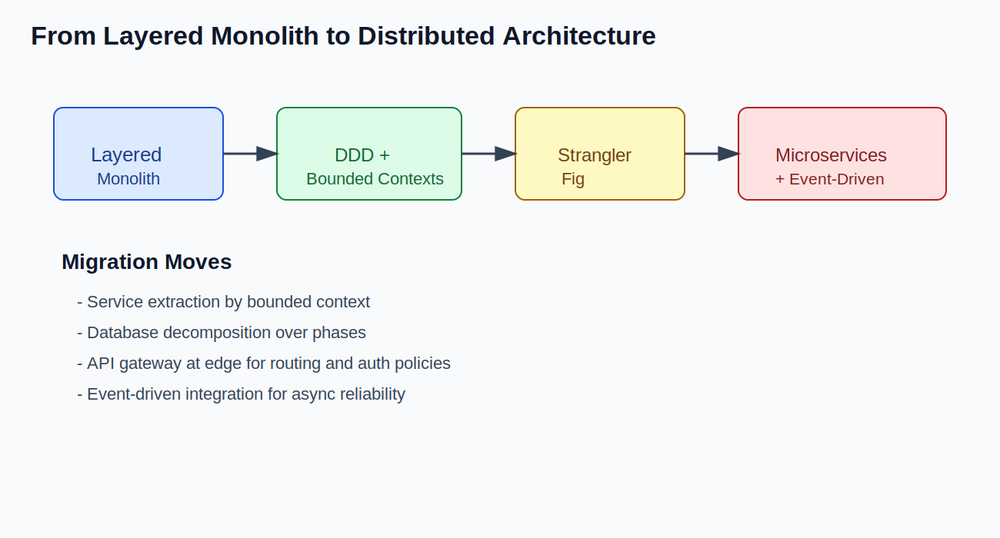
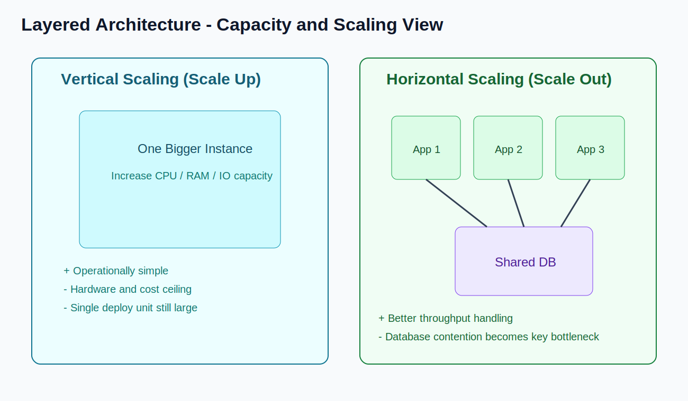

# Layered Architecture - Delivery Framework for System Design Interviews

## 1) Definition & Overview

### Definition

Layered Architecture is an architectural style that organizes an application into logical layers, where each layer has a specific responsibility and typically depends only on the layer below it.

In many real-world implementations, layered architecture is deployed as a **single monolithic unit**.

### Core Characteristics

- Single codebase (in common monolithic implementations)
- Single deployment unit
- Shared database
- Tightly coupled modules over time if boundaries are not enforced
- Clear layer boundaries: Controller -> Service -> Repository -> Database

### Typical Tech Stacks

- Java: Spring Boot / Spring MVC
- Python: Django
- Ruby: Ruby on Rails
- .NET: ASP.NET Core
- Node.js: Express + service/repository layering

## 2) Where It Is Used (Use Cases)

Layered architecture is commonly used in:

- Early-stage startups
- Small to medium-sized applications
- Internal enterprise tools
- Systems with simple domain boundaries
- Traditional enterprise systems (ERP-style applications)

Brief real-world examples (high level):

- Internal HR/payroll applications in enterprises
- Admin portals and workflow systems
- Early versions of many SaaS products before service decomposition

## 3) Apply the Delivery Framework

### A) Functional Requirements

How layered architecture handles core functions:

- User management: handled through controller/service/repository modules
- CRUD operations: straightforward via service and data access layers
- Authentication: centralized in middleware/filters/service layer
- Business logic processing: concentrated in service layer for maintainability

Typical request path:

- Controller receives request
- Service executes business logic
- Repository/ORM persists or fetches data
- Response is returned from controller

### B) Non-Functional Requirements

How layered architecture handles NFRs:

- Scalability: reasonable at low-mid scale; coarse-grained scaling at app level
- Availability: can run multiple replicas behind a load balancer
- Consistency: strong consistency is easier with one shared relational DB
- Latency: low internal latency due to in-process calls
- Security: centralized enforcement is easier in one deployable
- Fault tolerance: lower isolation; faults in one module can affect the process

Trade-offs:

- Strong simplicity and productivity early
- Reduced independent scaling and isolation later

### C) Capacity Considerations

- Vertical scaling: increase resources of the same application node
- Horizontal scaling: replicate entire application layer
- Single database bottleneck: DB often becomes throughput/lock/contention hotspot
- Deployment scaling strategy: all layers are redeployed together

Impact summary:

- Application tier can scale with replicas
- Database scaling and write contention become primary limits

## 4) Core Entities

How entities are typically managed:

- Shared data model across modules
- Centralized database schema
- ORM usage (JPA/Hibernate, Django ORM, ActiveRecord, EF Core)
- Domain logic can become tightly coupled with persistence models

Result:

- Easy joins and transaction handling
- Harder to enforce strict domain boundaries at scale

## 5) API / System Interface

Typical interfaces in layered architecture:

- Usually REST APIs externally
- Internal method calls between layers/modules
- In-process communication instead of network calls for intra-app flows

This keeps interaction simple but increases coupling inside one runtime.

## 6) High-Level Architecture Diagram (Conceptual Explanation)

### Diagram

### Components

- Load Balancer
- Application Server (Single Deployable Unit)
- Database
- Cache (optional)

### Request Flow

1. Client sends request to Load Balancer
2. Load Balancer forwards request to app instance
3. Controller layer validates and routes request
4. Service layer applies business rules
5. Repository and ORM layer interacts with DB
6. Optional cache read/write for hot data
7. Response is returned to the client

## 7) Pros (Advantages)

- Simpler development and team onboarding
- Easier local setup
- Easier debugging due to single runtime context
- Strong consistency with centralized transactions
- Simpler transaction management
- Faster initial development velocity
- Easier testing in early and mid-stage systems

## 8) Cons (Limitations)

- Tight coupling can grow between modules/layers
- Hard to scale specific components independently
- Large codebase complexity over time
- Slower deployments as application grows
- Technology lock-in due to unified stack
- Risk of broader system impact from single deploy issues
- Organizational scaling challenges for many parallel teams

## 9) How We Overcame Layered Architecture Limitations

Common evolution strategies:

- Domain-Driven Design (DDD)
- Service extraction strategy
- Database decomposition
- Migration to Microservices
- Strangler Fig pattern
- API gateway introduction
- Event-driven architecture

### Evolution Diagram

## 10) When to Choose Layered Architecture

| Decision Dimension | Choose Layered Architecture | Prefer Microservices |
| --- | --- | --- |
| Team size | Small to medium team | Multiple autonomous teams |
| Product maturity | Early-stage or evolving domain | Mature domains with stable boundaries |
| Scaling needs | Moderate, mostly uniform | Uneven high scale by domain |
| Operational complexity | Low complexity preferred | Higher complexity acceptable |
| DevOps maturity | Basic CI/CD + monitoring | Advanced DevOps/SRE maturity |

### Capacity Visual

## Conclusion

Layered Architecture remains a strong and practical default for many systems.

It enables fast delivery, clear structure, and strong consistency in early and medium growth phases.

As complexity grows, teams should evolve architecture deliberately using extraction and decomposition patterns.

**Evolution > premature optimization.**

## Search Keywords

`layered architecture` `n tier architecture` `controller service repository pattern` `system design layered architecture` `high level design layered architecture` `single deployable architecture` `shared database design` `monolith layering` `layered vs microservices` `ddd` `strangler fig pattern` `service extraction` `database decomposition` `system design interview`
