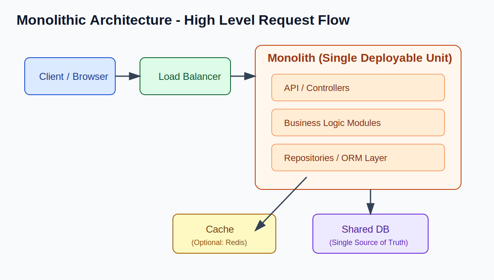
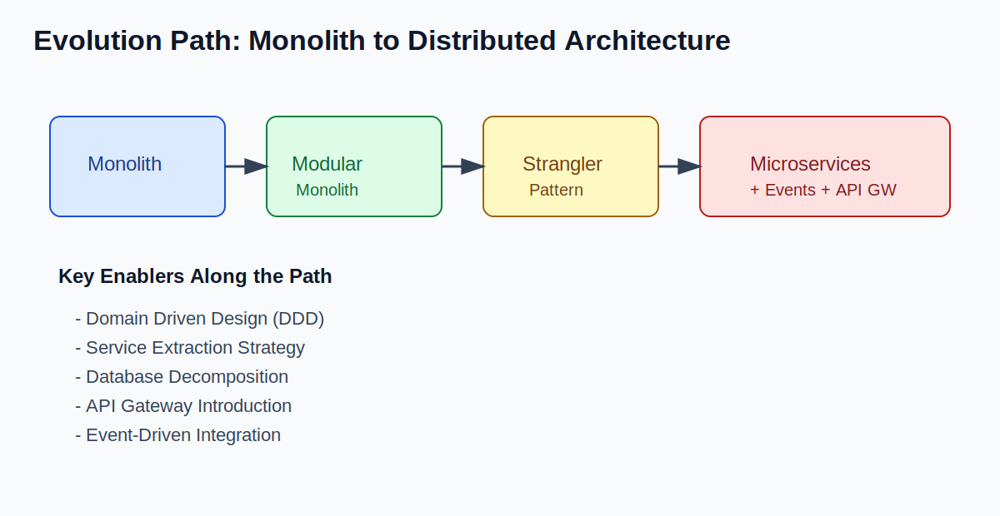
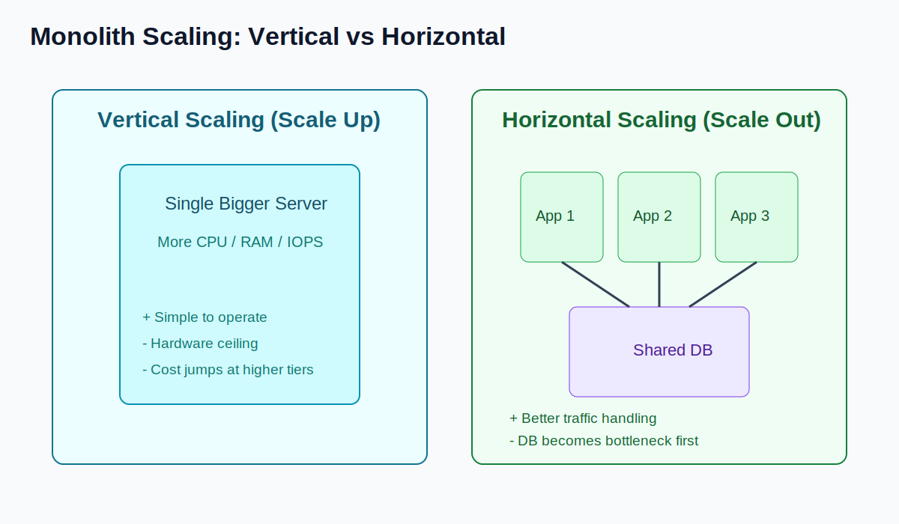

# Monolithic Architecture - Delivery Framework for System Design Interviews

## 1) Definition & Overview

### Definition

Monolithic Architecture is a software architecture where the entire application is built and deployed as a **single unit**. All modules (auth, user, payments, reporting, etc.) live in one codebase and usually run in one process (or identical replicated processes).

### Core Characteristics

- Single codebase
- Single deployment artifact (one app deploy)
- Shared database
- Tightly coupled modules (compile-time and runtime coupling)
- In-process module communication (function/method calls)

### Common Tech Stacks

- Java: Spring Boot / Spring MVC
- Python: Django
- Ruby: Ruby on Rails
- PHP: Laravel
- .NET: ASP.NET MVC / ASP.NET Core monoliths

## 2) Where It Is Used (Use Cases)

Monolithic architecture is commonly used in:

- Early-stage startups (speed > platform complexity)
- Small to medium applications with manageable traffic
- Internal enterprise tools (HR, admin, operations dashboards)
- Systems with simple domain boundaries
- Traditional enterprise systems (ERP-style business suites)

Brief real-world examples (high-level):

- Many successful products started as monoliths before decomposing later.
- Large e-commerce and SaaS companies often began with a monolithic core in early stages.

## 3) Apply the Delivery Framework

### A) Functional Requirements

How a monolith handles core functional needs:

- User management: user module in same app (profile, roles, permissions)
- CRUD operations: direct controller -> service -> repository flow
- Authentication: centralized auth logic (session/JWT) inside same deployable
- Business logic processing: orchestration across modules via in-process calls

Because all logic is in one runtime boundary, cross-module operations are straightforward.

### B) Non-Functional Requirements

How monoliths perform across NFRs:

- Scalability: good initially, but scaling is coarse-grained (scale whole app)
- Availability: can be high with replicas, but failures can affect full app behavior
- Consistency: strong consistency is easier with one DB and local transactions
- Latency: low internal latency due to in-process calls (no network hops)
- Security: centralized policy enforcement is simpler early on
- Fault tolerance: weaker isolation; one bad module can impact whole process

Trade-offs:

- Gains simplicity and consistency early
- Pays cost later in agility, blast radius, and scaling precision

### C) Capacity Considerations

- Vertical scaling: increase CPU/RAM for single instance; simplest first step
- Horizontal scaling: replicate whole monolith behind load balancer
- Single database bottleneck: DB CPU/IOPS/locks often become first hard limit
- Deployment scaling strategy: every change ships entire app, even small features

Minimal impact summary:

- App layer can scale reasonably with replicas
- Data layer scaling and write contention become key constraints

## 4) Core Entities

Entity handling in monoliths typically includes:

- Shared data model across modules
- Centralized relational schema (single logical source of truth)
- ORM-heavy mapping (JPA/Hibernate, Django ORM, ActiveRecord)
- Domain logic often co-located and tightly coupled to persistence concerns

Result:

- Easy joins and transactional workflows
- Harder long-term boundary enforcement between domains

## 5) API / System Interface

Typical interface model:

- External interface: REST APIs (sometimes GraphQL)
- Internal interface: method/function calls between modules
- Communication style: in-process, not network-based RPC between internal features

This reduces network complexity but increases runtime coupling.

## 6) High-Level Architecture Diagram (Conceptual)

### Diagram

### Components

- Load Balancer: distributes requests across monolith replicas
- Application Server: single deployable containing all modules
- Database: shared persistent store for all domains
- Cache (optional): used for hot reads and latency reduction

### Request Flow

1. Client sends request to Load Balancer
2. Load Balancer forwards to Monolith instance
3. Controller validates and routes request
4. Business module executes logic (auth/rules/workflows)
5. Repository/ORM reads/writes shared database
6. Response returned through same app instance
7. Optional cache is read/written for performance

## 7) Pros (Advantages)

- Simpler development model
- Easier local setup and onboarding
- Easier debugging (single runtime)
- Strong consistency with local ACID transactions
- Simpler transaction management
- Faster initial delivery speed
- Easier end-to-end testing in early stages

## 8) Cons (Limitations)

- Tight coupling between modules
- Cannot scale one hotspot independently
- Large codebase complexity as product grows
- Slower deployments over time
- Technology lock-in (whole app tied to stack choices)
- Higher risk of full-system impact on failures
- Organizational scaling challenges across many teams

## 9) How We Overcame Monolithic Limitations

Common evolution patterns:

- Modular Monolith (enforce internal boundaries first)
- Domain-Driven Design (DDD) for clear bounded contexts
- Service Extraction Strategy (lift one domain at a time)
- Database Decomposition (per-domain ownership over time)
- Migration to Microservices based on clear bottlenecks
- Strangler Fig Pattern for incremental replacement
- API Gateway introduction for edge routing and policy
- Event-Driven Architecture for decoupled integration

### Evolution Visual

## 10) When to Choose Monolith vs Microservices

| Decision Dimension | Choose Monolith | Choose Microservices |
| --- | --- | --- |
| Team Size | Small team (e.g., 2-15) | Multiple autonomous teams |
| Product Maturity | Early-stage, evolving rapidly | Mature domains with stable boundaries |
| Scaling Needs | Moderate, mostly uniform traffic | Uneven scaling by capability/domain |
| Operational Complexity | Prefer low ops overhead | Can handle platform complexity |
| DevOps Maturity | Basic CI/CD and observability | Strong CI/CD, SRE, platform engineering |

### Scaling Note

## Conclusion

Monolithic architecture is **not bad by default**.

It is often the **right starting point** because it optimizes for speed, simplicity, and strong consistency.

Microservices should be adopted only when complexity is justified by scale, team structure, and operational maturity.

**Evolution beats premature optimization.**

## Search Keywords

`monolithic architecture` `modular monolith` `system design monolith` `high level design monolith` `hld monolith` `single deployable unit` `shared database architecture` `monolith vs microservices` `strangler fig pattern` `service extraction` `domain driven design` `ddd` `software architecture interview` `system design interview`
