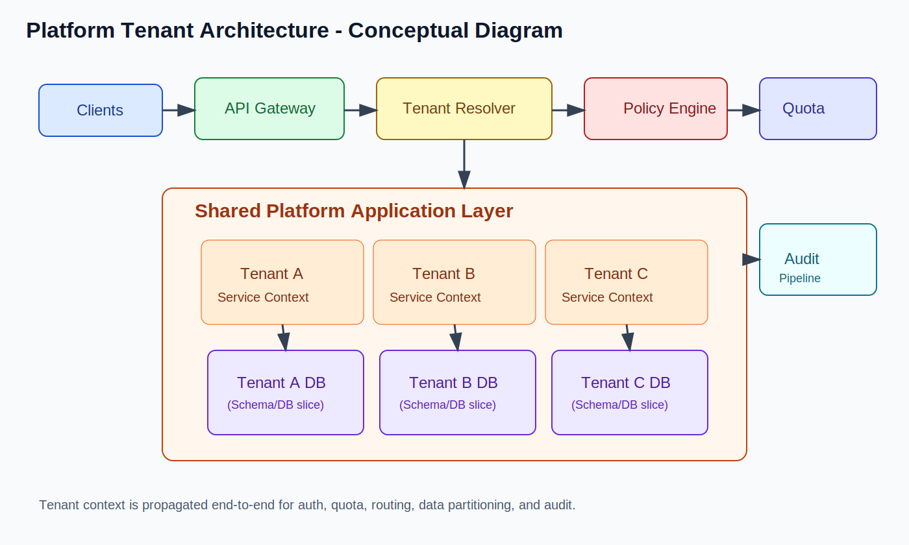

# Platform Tenant Architecture

Source: added using the same delivery framework pattern.

### 11.1 Definition and Overview

Platform Tenant Architecture (often called Multi-Tenant Platform Architecture) is a model where one platform serves multiple tenants (customers/organizations) with controlled isolation for data, compute, and operations.

Core characteristics:

- Shared platform capabilities across tenants
- Tenant isolation at data, compute, and access-control layers
- Tenant-aware routing, configuration, and quotas
- Standard onboarding/provisioning workflows

Typical stack examples:

- Kubernetes + namespace/cluster isolation
- Postgres with schema-per-tenant or DB-per-tenant patterns
- Cloud IAM + policy-based tenant access controls

### 11.2 Where it is used

- B2B SaaS products
- Enterprise platforms with many customer accounts
- Internal multi-business-unit platforms
- Regulated products needing tenant-level isolation and auditability

### 11.3 Delivery Framework

Functional requirements:

- Tenant onboarding and lifecycle management
- Tenant-scoped user management and RBAC
- Tenant-specific configuration and feature flags
- CRUD and business workflows scoped by tenant context

Non-functional requirements:

- Scalability: supports large tenant counts and variable tenant sizes
- Availability: tenant failures should not cascade platform-wide
- Consistency: strong tenant-local consistency with controlled cross-tenant operations
- Latency: route to nearest/least-loaded tenant slice where possible
- Security: strict tenant isolation, encryption, audit trails
- Fault tolerance: noisy-neighbor control, per-tenant throttling and circuit limits

Capacity considerations:

- Tenant distribution strategy (small/medium/large buckets)
- Storage and compute quota planning per tenant tier
- Hot-tenant mitigation (dedicated resources or cell migration)
- Shared vs dedicated tenant deployment economics

### 11.4 Core entities

- `Tenant`
- `TenantUser`
- `TenantConfig`
- `TenantQuota`
- `TenantSubscription`
- `TenantAuditEvent`

Entity management patterns:

- Tenant ID as a mandatory partition key
- Centralized tenant catalog/control-plane metadata
- Strong access checks on every tenant-scoped read/write

### 11.5 API and interface

- External APIs are tenant-aware (`tenant_id`, subdomain, token claims)
- Internal services propagate tenant context end-to-end
- In-process module calls remain tenant-scoped in layered/monolith services
- Cross-tenant admin APIs are tightly restricted and audited

### 11.6 Diagram and flow



Conceptual flow:

```text
Client -> API Gateway -> Tenant Resolver -> App Service -> Tenant Data Store
                    -> Policy Engine -> Quota/Rate Limit -> Audit Pipeline
```

Request flow:

1. Request arrives with tenant context (subdomain/claim/header)
2. Gateway resolves tenant and validates policy
3. Service executes tenant-scoped business logic
4. Data access enforces tenant partition/isolation
5. Quotas and limits are checked
6. Audit event is emitted with tenant metadata

### 11.7 Pros

- High platform reuse across customers
- Faster product rollout across many tenants
- Strong governance and standardization possibilities
- Better unit economics with shared infrastructure

### 11.8 Cons

- Isolation mistakes can cause severe data leaks
- Noisy-neighbor and fairness challenges
- Complex tenant lifecycle and migration operations
- Harder debugging due to tenant-specific behavior/config

### 11.9 How we overcome limitations

- DDD with tenant-aware bounded contexts
- Service extraction for high-risk or high-load tenant domains
- Database decomposition (shared -> schema-per-tenant -> DB-per-tenant when needed)
- Strangler pattern for gradual migration of tenant-critical paths
- API gateway enforcement for tenant auth, rate limits, and policies
- Event-driven architecture for tenant lifecycle and async workflows
- Per-tenant observability dashboards and alerting

### 11.10 When to choose

| Decision Dimension | Choose Platform Tenant Architecture | Prefer Single-Tenant/Simpler Model |
| --- | --- | --- |
| Team size | Platform + product teams available | Very small team |
| Product maturity | Multi-customer SaaS phase | Single-customer or early prototype |
| Scaling needs | Many tenants with growth variance | Low tenant count, predictable load |
| Operational complexity | Can operate isolation + quotas + governance | Need very low operational overhead |
| DevOps maturity | Strong CI/CD, observability, policy automation | Basic DevOps setup |

Conclusion: Choose Platform Tenant Architecture when scale, customer count, and isolation requirements justify shared-platform complexity.
