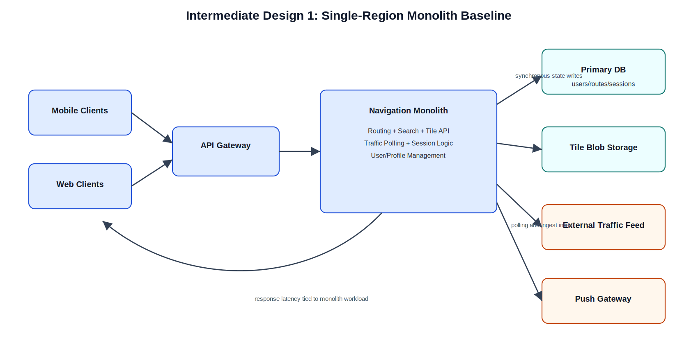
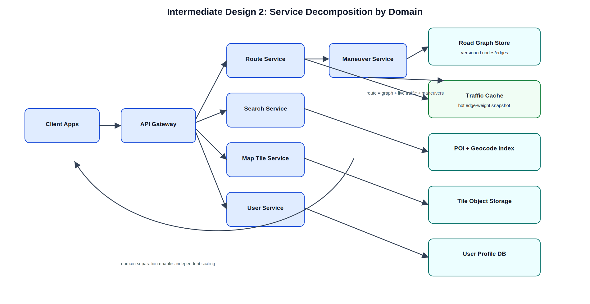
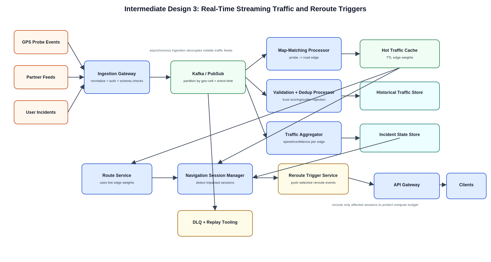
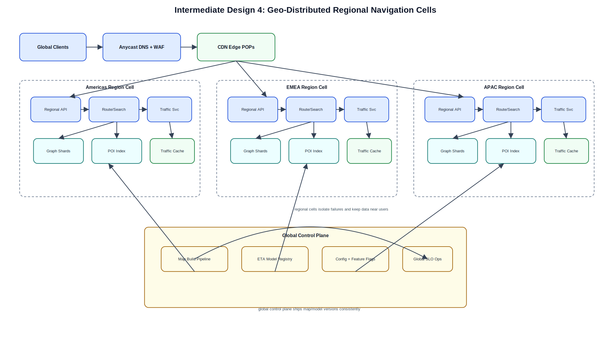
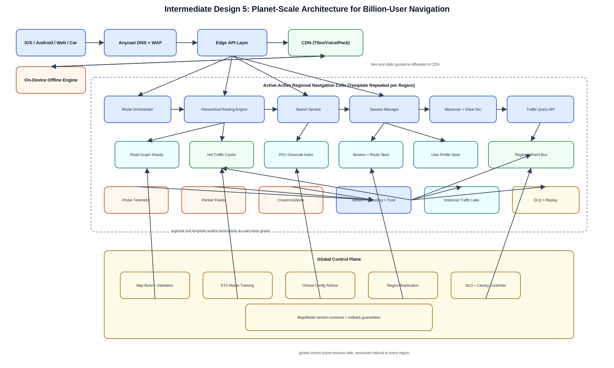
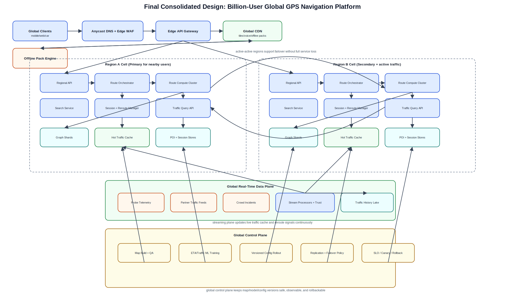

# GPS Navigation System Design (Staff-Level, Interview Delivery Framework)

## 0) Scope and Interview Framing (first 30-60s)

Design a global GPS navigation platform (Google Maps class) that supports real-time turn-by-turn routing, search, traffic-aware rerouting, map visualization, offline navigation, and user incident reporting.

Target scale for this design:
- 1B registered users.
- 150M DAU.
- 20M-30M concurrent active sessions at peak commute windows.

Out of scope for this round:
- Autonomous driving stack.
- Indoor positioning and AR navigation.
- Ads marketplace and merchant bidding systems.

---

## 1) Requirements (~5 min)

### 1.1 Functional requirements (prioritized)

Top 3 (what I would align on first in interview):
1. Users can request routes (fastest/shortest) and receive turn-by-turn guidance.
2. System can dynamically reroute using real-time traffic/incidents.
3. Users can search locations/POIs and visualize map tiles with traffic overlays.

Secondary (still required in final system):
1. Multi-modal routing (driving/walking/cycling).
2. Alternative route suggestions.
3. Voice guidance in multiple languages.
4. Offline map + routing pack downloads.
5. User preferences and favorites.
6. Traffic alerts and push notifications.
7. User incident/map issue reporting.

### 1.2 Functional requirements in detail (staff-level discussion)

| Functional Requirement | What users expect | Design implication | Trade-off / risk |
|---|---|---|---|
| Real-time navigation | Accurate, low-latency route and instructions while moving | Session manager + route service + frequent position updates; server/client reroute split | Too-frequent reroutes cause route thrash and battery drain |
| Dynamic rerouting | Recompute quickly when congestion/closure appears | Traffic cache with hot edge weights; incremental reroute strategy | Stale traffic can create wrong ETAs |
| Multi-modal support | Correct constraints per mode (one-way, footpath, bike lanes) | Mode-specific graph profiles and turn-cost tables | More storage + preprocessing complexity |
| Route optimization | Fastest/shortest plus user preferences | Composite cost function: travel time + penalties (tolls/highways/ferries) | Highly customized routes reduce cache hit rates |
| Alternative routes | 2-3 meaningful options | K-shortest path variants with diversity constraints | Too many alternatives increase compute and UI confusion |
| Search and autocomplete | Instant local suggestions and accurate geocoding | Prefix + fuzzy index with geo-filter and popularity ranking | Relevance quality depends on good ranking features |
| Map display + overlays | Smooth pan/zoom map with traffic coloring | CDN + vector tile pipeline + style versioning | Overlay consistency can lag base map updates |
| Voice guidance | Correct timing and localized instructions | Maneuver generation + TTS asset service + locale fallback | Language coverage and pronunciation quality |
| Offline navigation | No-network guidance in downloaded regions | Offline graph packs with compressed metadata and expiry versions | Pack freshness and device storage constraints |
| User profile/preferences | Save favorites and routing preferences | Profile service, durable storage, secure auth | Privacy concerns around sensitive location history |
| Traffic/incident alerts | Timely warnings and reroutes | Event stream + geofenced subscription service | Excessive alerting reduces trust |
| User reporting | Crowdsource incidents with location + severity | Report ingestion, trust scoring, clustering, moderation | Abuse/spam/fake reports require validation |

### 1.3 Non-functional requirements (top 8)

| Non-functional Requirement | Target | Why it matters | Architecture consequence |
|---|---|---|---|
| Route API latency | P95 < 300 ms, P99 < 500 ms | Navigation must feel immediate at turns | Hierarchical routing, preprocessed graph, hot cache for traffic weights |
| Tile latency | P95 < 80 ms from edge cache | UI responsiveness while panning/zooming | Heavy CDN usage, vector tiles, regional edge POPs |
| Availability | 99.99% API availability | Navigation is safety-critical during travel | Active-active multi-region, graceful degradation, offline fallback |
| Scale | Support 1B users, 150M DAU, 100k+ route RPS peak | Global adoption with commute spikes | Regional sharding, autoscaling compute, queue decoupling |
| Data freshness | Traffic updates every 1-5 minutes in active corridors | ETA quality and rerouting correctness | Streaming ingestion + low-latency cache invalidation |
| Consistency model | Strong consistency for user writes, eventual for traffic overlays | Balance correctness and speed | CP for profile writes; AP-friendly read path for map/traffic |
| Security/privacy | Encryption in transit/at rest, strict authN/Z, minimization of precise location retention | Sensitive geolocation data and compliance | Token auth, scoped data access, retention policies |
| Energy efficiency | Minimize mobile battery and radio usage | Navigation sessions can be hours long | Adaptive GPS sampling, predictive tile prefetch, delta updates |

### 1.4 CAP stance

1. Routing/session reads prioritize availability with bounded staleness.
2. User profile updates prioritize consistency.
3. Traffic overlays accept eventual consistency; stale/uncertain segments receive confidence penalties in routing.

### 1.5 Capacity estimation (only math that changes design)

Assumptions used to drive architecture:
1. 150M DAU.
2. Average 6 route computations per DAU/day (initial + reroutes) => about 900M route compute calls/day.
3. Average route responses and maneuver payload about 8 KB.
4. Peak multiplier 10x over daily average during regional commute spikes.

Implications:
1. Route compute QPS average: about 10.4k/s; peak: about 100k/s.
2. Route response egress: about 7.2 TB/day (without tiles).
3. Map/tile egress dominates cost and throughput. If each DAU pulls 12 MB/day of vector/raster data, tile egress is about 1.8 PB/day. This requires CDN-first design.
4. Traffic stream sizing: if 300M road segments globally and 2% change every 5 minutes, about 6M updates/5 min, which justifies streaming ingestion + partitioned state store.

---

## 2) Core Entities (~2 min)

Initial entity set (kept intentionally small and evolved during design):
1. `User`
2. `RouteRequest`
3. `RoutePlan`
4. `NavigationSession`
5. `RoadNode`
6. `RoadEdge`
7. `TrafficEdgeState`
8. `IncidentReport`
9. `Place` (POI/address)
10. `MapTile`
11. `OfflinePack`

Critical fields (only design-relevant):
- `RouteRequest`: `request_id`, `user_id`, `origin`, `destination`, `mode`, `preferences`, `requested_at`
- `RoutePlan`: `route_id`, `request_id`, `polyline`, `maneuvers`, `eta_seconds`, `distance_m`, `alternatives[]`, `version`
- `TrafficEdgeState`: `edge_id`, `speed_kph`, `confidence`, `source_mix`, `updated_at`, `ttl`
- `IncidentReport`: `incident_id`, `reporter_id`, `lat`, `lng`, `type`, `severity`, `status`, `created_at`
- `MapTile`: `tile_id(z/x/y)`, `style_version`, `content_hash`, `blob_uri`, `region`

---

## 3) API / System Interface (~5 min)

Protocol choices:
1. REST for public mobile/web clients.
2. gRPC for internal low-latency service-to-service calls.
3. Streaming bus (Kafka/PubSub) for traffic/incidents/events.

### 3.1 Route computation

`POST /v1/routes`

```json
{
  "origin": {"lat": 37.7749, "lng": -122.4194},
  "destination": {"lat": 37.3382, "lng": -121.8863},
  "mode": "driving",
  "preferences": {
    "avoid_tolls": true,
    "avoid_highways": false,
    "avoid_ferries": true
  },
  "alternatives": 2
}
```

Response:

```json
{
  "route_id": "rt_8f1",
  "primary": {
    "eta_seconds": 3810,
    "distance_m": 70700,
    "polyline": "...",
    "maneuvers": ["Head south", "Take ramp ..."]
  },
  "alternatives": [
    {"route_id": "rt_alt_1", "eta_seconds": 3960, "distance_m": 66200}
  ],
  "traffic_snapshot_at": "2026-02-25T18:10:00Z"
}
```

### 3.2 Reroute refresh

`POST /v1/navigation/sessions/{session_id}/reroute`

Input includes latest GPS location and heading; output contains updated maneuver list and ETA.

### 3.3 Search

`GET /v1/search/suggest?q=starb&lat=37.77&lng=-122.41&radius_m=20000`

### 3.4 Tiles and overlays

`GET /v1/tiles/vector/{z}/{x}/{y}?style=default&traffic=true`

### 3.5 User profile and favorites

`GET /v1/users/me/profile`

`POST /v1/users/me/profile`

### 3.6 User incident report

`POST /v1/incidents`

```json
{
  "location": {"lat": 37.6, "lng": -122.2},
  "type": "accident",
  "severity": "high",
  "description": "2 lanes blocked"
}
```

### 3.7 Offline pack

`GET /v1/offline/packs?region_id=us-ca-bay-area`

`POST /v1/offline/packs/{pack_id}/download-token`

Security notes:
1. Derive user identity from auth token, never from request body.
2. Sign and rate-limit incident/report endpoints.
3. Apply per-token scope enforcement for location and history retrieval.

---

## 4) Optional Data Flow (~5 min)

### 4.1 Route request flow

1. Client sends `POST /v1/routes` with origin/destination/mode/preferences.
2. API Gateway validates token and forwards to Route Orchestrator.
3. Orchestrator fetches nearest graph cells, reads live traffic edge weights from hot cache.
4. Routing Engine runs hierarchical shortest-path (preprocessed base graph + dynamic overlay penalties).
5. Maneuver Service generates turn instructions and lane guidance.
6. ETA Service calibrates ETA using live and historical speed models.
7. Response returned to client; session manager stores lightweight session state.

### 4.2 Traffic update flow

1. Probe telemetry + third-party feeds + user reports enter ingestion layer.
2. Stream processors deduplicate, map-match to road edges, and compute confidence-scored speed estimates.
3. Hot traffic cache updates edge weights with TTL.
4. Reroute triggers are emitted when affected sessions cross impact thresholds.

### 4.3 Offline pack flow

1. Client requests region pack metadata and available version.
2. CDN serves compressed vector graph/tile bundle.
3. Client validates checksum/signature and stores pack.
4. On no-network condition, local route engine uses pack graph and onboard heuristics.

---

## 5) High-Level Design (~10-15 min): Iterative Build-Up

## Intermediate Design 1: Basic single-region monolith (working baseline)



### How this flow works

1. Mobile client calls API Gateway.
2. Gateway forwards to one monolithic Navigation App (route, search, map, traffic logic together).
3. Monolith reads/writes a single primary database for user/profile/session and some route artifacts.
4. Monolith fetches tiles from object storage and directly polls external traffic provider.
5. Monolith computes route and returns turn-by-turn response.

### Why start here

1. Fastest way to ship end-to-end functionality.
2. Low operational overhead for an early-stage product.
3. Easy local debugging because most logic is in one service.

### Disadvantages

1. Routing compute, search, and traffic polling contend on same compute pool.
2. Single-region deployment causes high global latency.
3. Tight coupling makes independent scaling impossible.
4. Any traffic feed outage directly impacts route API path.

---

## Intermediate Design 2: Service decomposition by domain



### How this flow works

1. API Gateway routes calls to specialized services: Route Service, Search Service, Map Tile Service, User Service.
2. Route Service reads road graph storage and traffic cache, then calls Maneuver Generator.
3. Search Service uses dedicated geo-index for POI/autocomplete.
4. Map Service serves vector/raster tiles from object store and cache.
5. User Service owns profile/preferences/favorites storage.

### Advantages over Design 1

1. Independent scaling: route compute nodes scale separately from search and tiles.
2. Clear ownership boundaries and team autonomy.
3. Better blast-radius isolation for localized failures.
4. Easier performance tuning per domain.

### New disadvantages introduced

1. Cross-service call overhead and more distributed failure modes.
2. Data ownership boundaries require better contracts and schema governance.
3. Operational complexity (service discovery, observability, deployment orchestration).

---

## Intermediate Design 3: Real-time traffic pipeline + async reroute triggers



### How this flow works

1. Probe telemetry, partner feeds, and user reports are ingested continuously.
2. Ingestion publishes normalized events to Kafka/PubSub.
3. Stream processors perform map matching, deduplication, outlier rejection, and confidence scoring.
4. Processed edge-speed states are written to hot geo-partitioned traffic cache and historical store.
5. Route Service consumes hot cache during compute; Session Manager receives event triggers to proactively reroute impacted users.

### Advantages over Design 2

1. Decouples volatile traffic ingestion from request-response route path.
2. Significantly fresher ETAs due to minute-level or sub-minute updates.
3. Better fault tolerance using replayable event log and DLQ.
4. Enables analytics/model training from historical traffic store.

### New disadvantages introduced

1. Event-time complexity (late/out-of-order data) and exactly-once challenges.
2. Higher operational load: schema evolution, partition strategy, lag monitoring.
3. Need strong data quality guardrails to avoid bad reroute decisions.

---

## Intermediate Design 4: Geo-distributed regional cells



### How this flow works

1. Global traffic enters Anycast DNS + edge routing; users hit nearest healthy region.
2. Each region (Americas/EMEA/APAC) runs a full navigation cell: API, route compute, search, map, traffic cache.
3. Region-local data stores host graph shards, tile cache, and POI indexes for nearby geographies.
4. A global control plane distributes map versions, model parameters, and service configs.
5. Cross-region failover shifts users to secondary regions if a primary region degrades.

### Advantages over Design 3

1. Major latency reduction by computing close to user.
2. Better resilience via cell-based isolation and failover.
3. Scales operationally by regional partitioning of data and teams.

### New disadvantages introduced

1. Cross-region data replication and version drift become hard.
2. Failover can increase latency and temporarily reduce freshness.
3. Requires strict release discipline for map/model consistency.

---

## Intermediate Design 5: Planet-scale billion-user architecture



### How this flow works

1. Clients (iOS/Android/Web/Car) use nearest edge POP for TLS termination, auth checks, and request shaping.
2. CDN serves most tile and static voice assets directly from edge cache, removing load from core services.
3. Route requests reach regional Route Orchestrator, which selects relevant graph shards by S2/H3 cells.
4. Hierarchical Routing Engine uses preprocessed contraction layers and applies live traffic overlay from hot cache.
5. ETA service calibrates with ML models (corridor, time-of-day, weather, event context).
6. Session Manager monitors live position deltas and triggers reroute only when gain threshold is meaningful.
7. Streaming pipeline continuously updates traffic cache from probes/partner feeds/user incidents.
8. Global control plane performs map builds, quality validation, canary rollout, and cross-region replication.
9. Offline pack service ships signed compressed packs; client runs local fallback engine when network is weak.

### Advantages over Design 4

1. Handles billion-user footprint with explicit separation of edge, regional data plane, and global control plane.
2. Cost-efficient due to CDN offload and tiered compute (cheap cache reads, expensive routing only when needed).
3. Better ETA quality with unified online + offline + model feedback loops.
4. Stronger user experience resilience with hybrid online/offline navigation.

### Remaining disadvantages / operational risks

1. Significant system complexity; requires mature platform engineering and SRE practice.
2. Model drift and bad map updates can impact many users if rollout safeguards fail.
3. High infra cost floor (global regions, streaming clusters, replication, observability).

---

## Final Design (consolidated diagram used in interview wrap-up)



Use this final diagram when interviewer asks, "How would you run this at Google Maps scale?"

---

## 6) Deep Dives (~10 min)

### 6.1 Routing algorithm strategy

Single algorithm is not enough at this scale. Use layered strategy:
1. Offline preprocessing: contraction hierarchies / multi-level partitioning for base travel-time graph.
2. Online query: bidirectional A* over preprocessed hierarchy for candidate routes.
3. Dynamic overlay: inject live traffic, incident closures, weather penalties, toll preferences.
4. Alternative generation: constrained K-shortest with path diversity constraints.

Why this combination:
1. Pure A* is flexible but expensive at global QPS.
2. Pure CH is fast but rigid for fast-changing traffic.
3. Hybrid keeps low latency while preserving dynamic updates.

### 6.2 Traffic estimation and confidence modeling

1. Data sources: anonymous probes, fleet/partner feeds, road sensors, user incidents.
2. Stream features: speed variance, source agreement, time-of-day baseline deviation, weather/event tags.
3. Confidence scoring determines whether edge update is trusted.
4. Low-confidence edges are penalized conservatively, not blindly applied.

Result:
- Safer ETAs and fewer false reroutes.

### 6.3 Storage model and partitioning

1. Road graph and topology: immutable-ish versioned store, partitioned by geo cells.
2. Traffic state: in-memory geo-partitioned cache with TTL + append-only event log for replay.
3. Search index: distributed inverted + geo index (prefix + fuzzy matching).
4. User/profile/history: strongly consistent distributed SQL/NoSQL depending on access pattern.
5. Tiles/assets: object storage + global CDN.

### 6.4 Caching hierarchy

1. Client cache: tiles, recent routes, voice assets, offline packs.
2. Edge cache: tile and style payloads.
3. Regional cache: hot traffic edges and top route templates.
4. Service-level cache: short-lived autocomplete prefixes by geo bucket.

Invalidation strategy:
1. Versioned map/tile keys.
2. TTL for traffic edges.
3. Event-driven invalidation for incidents and closures.

### 6.5 Reliability and failure handling

1. Region outage: Anycast reroutes to nearest healthy region.
2. Traffic provider outage: fall back to recent historical patterns + confidence downgrade.
3. Streaming lag: route service uses last-good snapshot and widens ETA uncertainty bounds.
4. Bad map rollout: canary + automatic rollback to previous map version.
5. Mobile offline/no-network: local graph routing with reduced feature set.

### 6.6 Privacy and security

1. Encrypt all user location telemetry in transit (TLS 1.2+) and at rest.
2. Minimize retention of raw precise traces; aggregate/anonymize quickly.
3. Role-based access for operational tools.
4. Auditable access logs and abuse detection for sensitive location queries.
5. Regional data residency controls where legally required.

### 6.7 Cost and efficiency controls

1. Route compute admission control and priority queues during spikes.
2. Opportunistic route cache for repeated OD pairs in same time window.
3. Demand-aware autoscaling by region and mode.
4. Push down rendering to client via vector tiles to reduce server-side render cost.

---

## 7) Mapping Requirements to Final Architecture

| Requirement | Final design mechanism |
|---|---|
| Fast route compute | Hierarchical routing + regional compute clusters + hot traffic cache |
| Dynamic rerouting | Session manager + streaming-triggered edge updates |
| Search relevance | Dedicated geo search stack with local context ranking |
| Smooth map display | CDN edge caching + vector tile pipeline |
| Offline support | Signed compressed packs + local fallback route engine |
| Scalability to 1B users | Edge/CDN offload + geo cells + active-active regional cells |
| Availability 99.99% | Multi-region failover + graceful degradation + rollback controls |
| Data freshness | Event streaming + low-latency traffic cache + confidence scoring |
| Security/privacy | Token auth, encryption, retention minimization, audit trails |
| Energy efficiency | Adaptive location sampling + delta updates + client-side caching |

---

## 8) Interview Delivery Script (short)

If I had 45 minutes, I would deliver in this order:
1. Requirements and scope (5 min).
2. Core entities and APIs (7 min total).
3. Baseline architecture (3 min).
4. Progressive scaling iterations (12-15 min).
5. Deep dives on routing algorithm, traffic freshness, and multi-region reliability (10 min).
6. Final trade-offs and risk register (5 min).

This keeps the interview grounded in a working system first, then hardens it toward billion-user operation.
