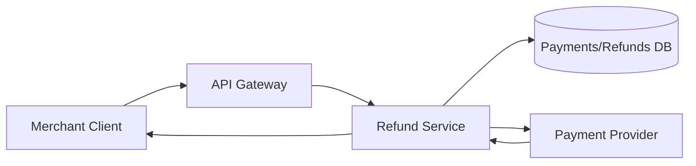
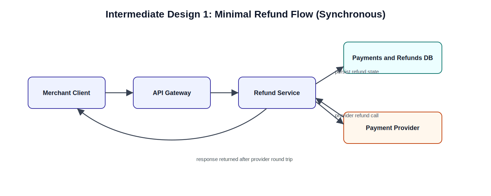
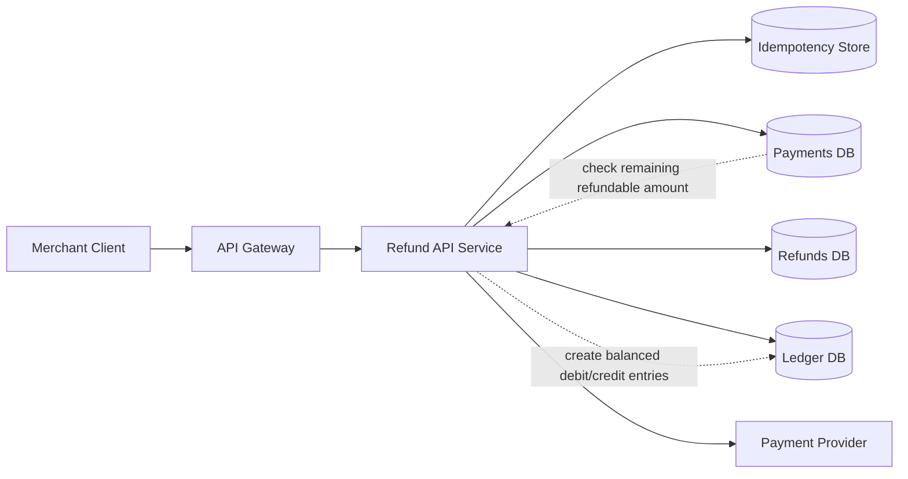
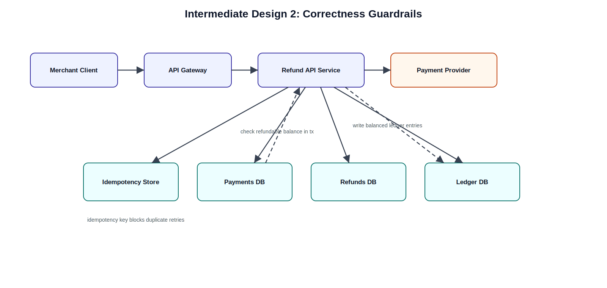
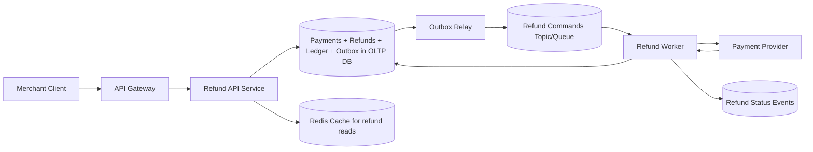
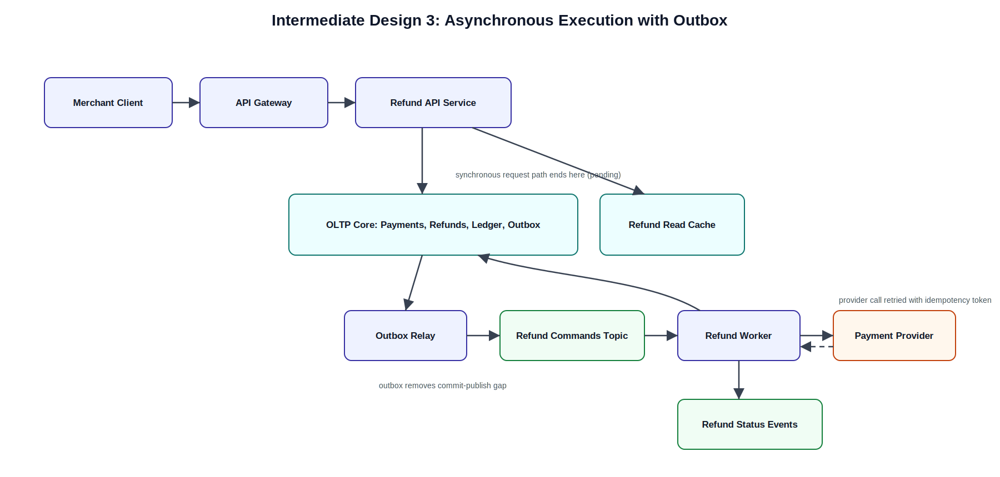
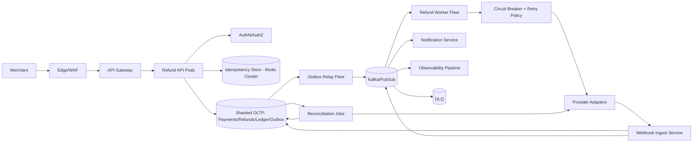
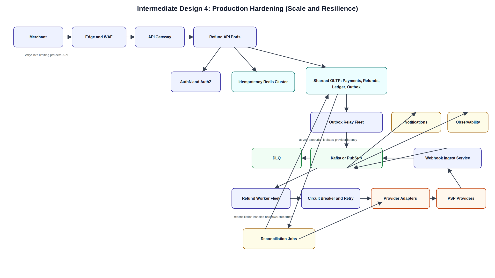
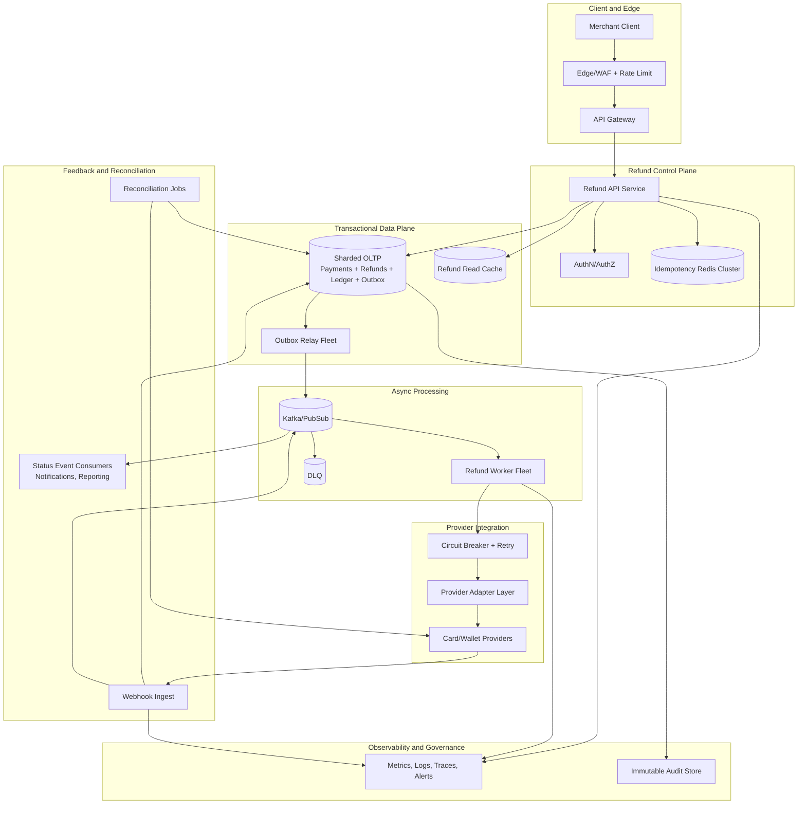
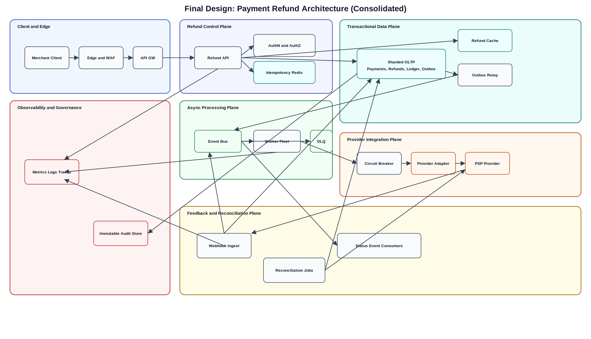

# Payment Refund System Design (Staff-Level, Interview Delivery Framework)

## 0) Scope and Interview Framing (first 30-60s)

Design a refund platform for card and wallet payments that supports full and partial refunds, gives fast API responses, and remains correct under retries, duplicates, and provider failures.

Out of scope for this round:
- Chargeback dispute workflows
- FX conversion optimization
- Merchant-facing analytics dashboards

---

## 1) Requirements (~5 min)

### 1.1 Functional requirements (prioritized top 3)

1. Merchants can create a full or partial refund for a captured payment.
2. Merchants can retrieve refund status (pending, succeeded, failed, unknown).
3. System enforces refund correctness: total refunded amount cannot exceed captured amount.

Secondary:
- Idempotent refund creation for client retries.
- Webhook-driven provider status updates.
- Merchant can list refunds for a payment.

### 1.2 Non-functional requirements (top 5)

1. Correctness first for money movement, then availability.
2. P99 API latency: create request < 300 ms (acknowledge async), read < 150 ms.
3. Scale target: 15k refund create RPS peak, 10x burst during incidents.
4. Durability and auditability: no lost refund intents, immutable money ledger.
5. Security/compliance: PCI scope minimized, strong authZ per merchant, full audit trail.

### 1.3 CAP stance

- For refund write path, choose consistency over availability for per-payment refund limit checks.
- For status reads, allow slightly stale reads using read replicas/cache.

### 1.4 Capacity estimation (only math that changes design)

We avoid broad estimation and do targeted sizing:

- Peak create QPS = 15k.
- If each refund creates about 2 KB total persisted records (refund row + ledger rows + outbox + metadata), write throughput is about 30 MB/s before replication.
- This drives a sharded OLTP store and asynchronous provider execution via queue, instead of synchronous provider call in API path.

---

## 2) Core Entities (~2 min)

1. Payment
2. Refund
3. RefundAttempt
4. LedgerEntry (double-entry)
5. IdempotencyKey
6. ProviderTransaction
7. WebhookEvent
8. ReconciliationRecord

Critical fields (only the ones that matter to design):

- Payment: `payment_id`, `merchant_id`, `captured_amount`, `currency`, `captured_at`, `version`
- Refund: `refund_id`, `payment_id`, `merchant_id`, `requested_amount`, `status`, `idempotency_key`, `created_at`
- LedgerEntry: `entry_id`, `account_id`, `amount`, `direction`, `reference_id`, `created_at`
- IdempotencyKey: `merchant_id`, `key`, `request_hash`, `refund_id`, `ttl`

---

## 3) API / System Interface (~5 min)

Protocol choice: REST for external merchant API, gRPC/internal events for service-to-service.

### 3.1 Create refund

`POST /v1/payments/{payment_id}/refunds`

```json
{
  "amount": 1250,
  "currency": "USD",
  "reason": "requested_by_customer",
  "metadata": {"order_id": "ord_123"}
}
```

Headers:
- `Authorization: Bearer <token>`
- `Idempotency-Key: <uuid>`

Response (accepted async):

```json
{
  "refund_id": "rf_789",
  "status": "pending",
  "payment_id": "pay_456"
}
```

### 3.2 Get refund

`GET /v1/refunds/{refund_id}`

### 3.3 List refunds by payment

`GET /v1/payments/{payment_id}/refunds`

### 3.4 Provider webhook ingest

`POST /v1/webhooks/providers/{provider}`

Security notes:
- Merchant identity comes from auth token, never from request body.
- Webhooks require signature verification and replay-window checks.

---

## 4) Optional Data Flow (~2-3 min)

1. Merchant submits refund request with idempotency key.
2. API validates merchant, payment ownership, amount, and currency.
3. System atomically persists refund intent + ledger hold/pending entries + outbox event.
4. Async worker calls payment provider refund API.
5. Provider response or webhook updates final status.
6. Reconciliation job resolves unknown/in-flight refunds.

---

## 5) High-Level Design (iterative, with intermediate diagrams)

## Intermediate Design 1: Minimal viable refund flow (synchronous)

Goal: deliver a working baseline quickly.





What this solves:
- End-to-end refund works.

Why it is not enough:
- Provider latency/failure in user path.
- Retry duplicates can double-refund.
- Weak audit boundary for financial correctness.

## Intermediate Design 2: Correctness guardrails

Add idempotency and ledger correctness before optimizing performance.





Key changes:
- Idempotency key deduplicates client retries.
- Atomic DB transaction enforces: `sum(successful_refunds) + new_refund <= captured_amount`.
- Immutable double-entry ledger gives auditable money trail.

## Intermediate Design 3: Asynchronous execution + Outbox

Remove provider dependency from synchronous API path.





Key changes:
- API responds fast with `pending` after durable commit.
- Outbox pattern prevents DB-commit/event-publish gap.
- Worker retries provider calls with backoff and idempotency token.

## Intermediate Design 4: Production hardening (scale + resilience)





What this adds:
- Horizontal scaling at API, relay, and worker layers.
- Circuit breaker for provider outages.
- DLQ and replay tooling for poison events.
- Reconciliation closes correctness gaps for ambiguous provider outcomes.

---

## 6) Deep Dives (~10 min)

### 6.1 Exactly-once vs effectively-once

- Distributed exactly-once is unrealistic across internal DB + external provider.
- We implement effectively-once behavior with:
  - Merchant idempotency key (API boundary)
  - Internal refund state machine with monotonic transitions
  - Provider idempotency token per refund attempt
  - Deduplication on webhook event IDs

### 6.2 Concurrency control for partial refunds

Problem: two concurrent partial refunds can overshoot captured amount.

Approach:
- Lock payment row with optimistic versioning or `SELECT ... FOR UPDATE` on payment aggregate.
- Validate remaining refundable amount inside same transaction that inserts refund row.
- Reject with `409 conflict_refund_limit_exceeded` when limit violated.

### 6.3 Refund state machine

States:
- `pending` -> `processing` -> `succeeded`
- `pending|processing` -> `failed`
- `processing` -> `unknown` (timeout/transport uncertainty)
- `unknown` -> `succeeded|failed` via webhook or reconciliation

Rule:
- Terminal states (`succeeded`,`failed`) are immutable.

### 6.4 Multi-region strategy

- Active-active API with shard affinity by `merchant_id` to avoid cross-region write conflicts.
- Provider-specific routing by region.
- Cross-region replicated event stream for disaster recovery.
- RPO near-zero for refund intent, RTO < 15 min.

### 6.5 Security/compliance

- Do not store raw PAN in refund service.
- Tokenized payment method references only.
- KMS-backed encryption at rest + TLS in transit.
- Fine-grained authZ: merchant can only refund own payments.
- Tamper-evident audit logs for SOC2/PCI evidence.

### 6.6 Observability and SLOs

Primary SLOs:
- Refund API availability: 99.95%
- P99 create latency: < 300 ms (acknowledged)
- 99% refunds finalized within 2 minutes

Critical metrics:
- Idempotency conflict rate
- Worker retry rate per provider
- Unknown-state aging (time in `unknown`)
- Reconciliation mismatch count
- DLQ depth and replay success rate

---

## 7) Final Design Diagram (consolidated)





---

## 8) Interview close-out (how a staff candidate lands this)

1. Reconfirm we met all top functional requirements.
2. Tie each non-functional requirement to a concrete mechanism in design.
3. Call out tradeoffs explicitly:
   - Chose async finalization for reliability and scale, at cost of eventual status.
   - Chose strong correctness checks on write path, at cost of occasional contention.
4. Mention next extension if asked: multi-provider smart routing and cost optimization.
