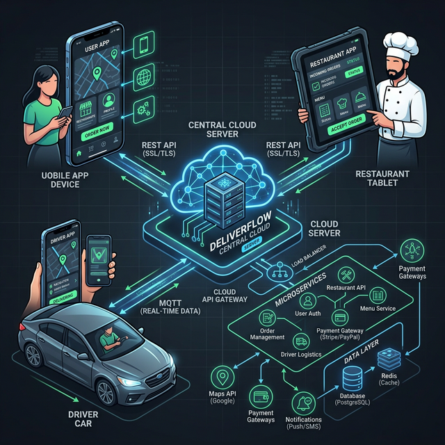
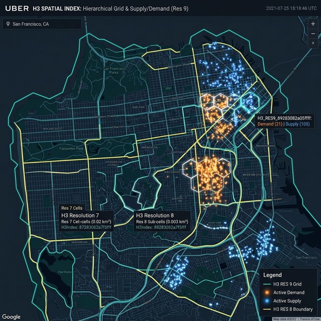
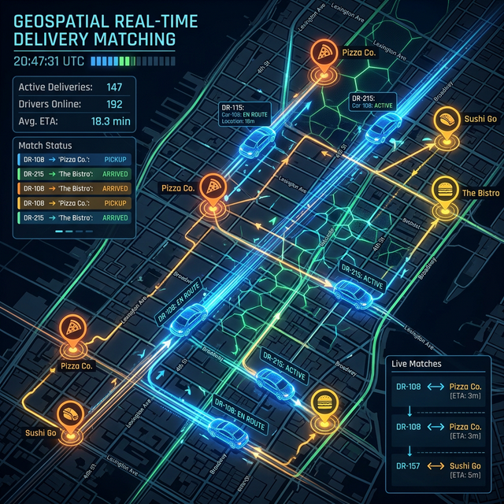

# Uber Eats System Design

## 1. Requirements (~5 mins)

**Functional Requirements:**
- **Users** should be able to view restaurants, browse menus, and place orders.
- **Restaurants** should be able to accept orders, update preparation status, and signal when food is ready.
- **Drivers (Couriers)** should receive dispatch requests based on proximity/ETA, accept them, and broadcast their location.
- **Users** should be able to view their order status and track the driver in real-time.

**Non-functional Requirements:**
- **High Availability & Low Latency** for browsing: Users should see restaurant menus almost instantly (< 200ms).
- **Strong Consistency** for ordering/payments: To prevent duplicate orders, overcharging, or lost revenue.
- **Extreme Write Scalability:** The system must handle frequent location pings from hundreds of thousands of active drivers globally.
- **Fault Tolerance:** If a driver loses connection or their app crashes, the system must retain their last known location and gracefully handle dispatch reassignments.

*Pros & Cons (Requirements prioritization):*
- **Pro:** By separating the read-heavy browsing workload from the write-heavy location tracking and consistent ordering workflows, we can scale distinct microservices independently.
- **Con:** This multi-modal architecture requires robust distributed transaction management (Sagas) to avoid inconsistent states across services.

**Capacity Estimation:**
- Assume 50M Daily Active Users (DAU) and 2M active drivers.
- Drivers ping location every 5 seconds. $2,000,000 \text{ drivers} / 5\text{s} = 400,000$ writes per second globally. This is massive and mandates in-memory or append-only data stores over traditional relational DBs.

---

## 2. Core Entities (~2 mins)
- **User:** The end-customer.
- **Restaurant (Store):** The vendor preparing the food.
- **MenuItem:** Distinct food items tied to a restaurant.
- **Order:** The core transactional entity mapping User, Restaurant, Driver, and Items. It moves through a strict lifecycle (`CREATED` $\rightarrow$ `ACCEPTED` $\rightarrow$ `PREPARING` $\rightarrow$ `DISPATCHED` $\rightarrow$ `EN_ROUTE` $\rightarrow$ `DELIVERED`).
- **Driver (Courier):** Delivery partner containing dynamic geospatial constraints (vehicle type, active status, current lat/lng).

*Pros & Cons (Entity modeling):*
- **Pro:** Formalizing the `Order` lifecycle state machine makes it easier to model events in Kafka/PubSub.
- **Con:** Synchronizing this `Order` state across multiple clients (User app, Restaurant tablet, Driver app) requires complex push notification or WebSocket infrastructure.

---

## 3. API or System Interface (~5 mins)

We will use REST for transactional operations and WebSockets/gRPC for real-time telemetry.

**REST Endpoints (Browsing & Ordering):**
```http
// Get nearby restaurants using H3/Geohash logic
GET /v1/stores?lat={latitude}&lng={longitude}
-> returns Store[]

// Place an order (Idempotent)
POST /v1/orders
Headers: { Idempotency-Key: "uuid" }
body: { store_id: string, items: {item_id, quantity}[] }
-> returns Order
```

**Real-time Endpoints (Telemetry & Communication):**
```http
// Driver telemetry ingest (High QPS)
POST /v1/couriers/{id}/location
body: { lat: number, lng: number, timestamp: long }

// Real-time tracking for Users
WebSocket /v1/orders/{id}/tracking
-> Ingests Kafka events and streams exact driver coordinates & ETAs.
```

---

## 4. High Level Design (~10-15 mins)

The following architecture utilizes a microservices paradigm to isolate fault domains:



### Key Components:
- **API/Edge Gateway:** Handles TLS termination, Rate Limiting, User Auth, and routes requests to backend services.
- **Store & Menu Service:** Read-heavy. Backed by **Redis** caches and a NoSQL DB (like Cassandra or DynamoDB) to quickly serve menus to millions of users.
- **Order Management Service:** The transactional core. Backed by a relational database (**PostgreSQL / CockroachDB**) to guarantee ACID properties during payment initiation and state transitions.
- **Location Ingestion Service:** Receives 400k+ GPS pings per second. Drops data directly into memory grids and Kafka for downstream processing.
- **Dispatch & Matching Engine:** Core algorithms that pair live orders with the closest available drivers based on calculated ETA matrices, not just linear distances.
- **Event Bus (Kafka):** Distributed log that acts as the nervous system, transmitting state changes (e.g., "Food Ready") to the exact services that need it (Notifications, Analytics, Dispatch).

---

## 5. Deep Dives (~15 mins)

This is where we address the true complexity of Uber Eats: **Geospatial Indexing**, **Distributed State**, and **ETA Prediction**.

### Deep Dive A: Geospatial Indexing & The H3 System

How do we actually find nearby drivers and restaurants efficiently? Standard SQL `WHERE lat/lng` queries fail at this scale.

**How Uber Eats Handles It:**
Uber doesn't just use standard Geohash quadrants; they invented and open-sourced **H3**, a hexagonal hierarchical spatial index.



- **Why Hexagons?** Unlike squares (Geohashes), hexagons have a uniform distance between the center and all edge neighbors. This makes radius queries and ETA aggregations mathematically smoother and more uniform.
- **Indexing:** The earth is divided into hexagons at various resolutions (Res 9 is approx the size of a city block). When a user opens the app, their device's lat/lng is instantly converted to an H3 index.
- **Matching:** The **Dispatch Service** looks up all active drivers currently sitting in the User's immediate H3 cell and the 6 neighboring cells (a "k-ring").
- **Sharding by Region:** The backend caches driver locations in Redis using the H3 index as the key (`h3_index_res8 -> [DriverA, DriverB]`). We hash the H3 Index to determine which Redis shard holds the local data.

*Pros & Cons:*
- **Pro:** H3 guarantees O(1) or O(log N) lookup times for drivers within a known radius.
- **Con:** Drivers cross hexagon boundaries frequently. Updating a driver's H3 index requires deleting from one cache list and inserting into another constantly, requiring atomic operations (e.g., Redis Lua scripts).

### Deep Dive B: Dispatch Architecture & Real-time Matching

Finding drivers is just step one. Matching them optimally is a classic *Bipartite Matching Problem*.



**How Uber Eats Handles It (Batch Bipartite Matching):**
Instead of assigning a driver the instant an order is placed (Greedy approach), Uber Eats batches dispatch requests in a short time window (e.g., every 5-10 seconds) for a specific geographic region.
1. The system creates a graph of **Orders** (supply) and **Drivers** (demand) in a region.
2. It calls the Maps API/Routing Service to generate ETAs for every possible combination (an ETA Matrix).
3. It runs a global optimization algorithm (like the Hungarian Algorithm) on this batch to minimize the *total* global wait time, rather than just optimizing for one specific user.

### Deep Dive C: Distributed Transaction Management (Saga Pattern)

An Uber Eats order involves payment, restaurant acceptance, driver dispatch, and user notification. We cannot put all this in a single DB transaction.

**How Uber Eats Handles It (Event-Driven State Machine):**
1. User clicks "Order" $\rightarrow$ `Order Service` creates a `PENDING` record.
2. `Order Service` sends a "Validate Payment" event to Kafka.
3. `Payment Service` consumes it, charges the card, and emits "Payment Success".
4. `Order Service` updates to `PAID` and emits "Notify Restaurant".
5. `Restaurant Service` pings the tablet. The chef taps "Accept", emitting "Order Preparing".
6. By leveraging Kafka and a **Saga Orchestrator** pattern, if any step fails (e.g., restaurant rejects), the Orchestrator fires a compensating transaction (e.g., refund the user's card and mark order `CANCELLED`).

### Deep Dive D: ETA Predictions & Machine Learning

A common trap in system design is assuming ETA is simply $Distance / Speed$. In cities, ETA involves traffic, restaurant prep times, parking, and walking to the apartment door.

**How Uber Eats Handles It (Michelangelo ML Platform):**
- Uber relies heavily on historical data. They feed features like *Time of Day, Weather, Historical Restaurant Prep Time, Traffic Data,* and *Courier Vehicle Type* into gradient boosted decision tree models (XGBoost) or deep neural networks.
- Before suggesting a delivery time to the user, an ETA prediction service executes an ML inference using the store ID and driver's current H3 cell.

---

### Final Summary
By combining **H3 Spatial Indexing** for fast geographical lookups, **Kafka** for resilient event choreography (Sagas), and intense **In-Memory Caching** (Redis) to absorb the massive 400k QPS location ingestion rate, we create a highly available, robust, and strongly consistent food delivery system that perfectly mimics the underlying architecture of platforms like Uber Eats.
